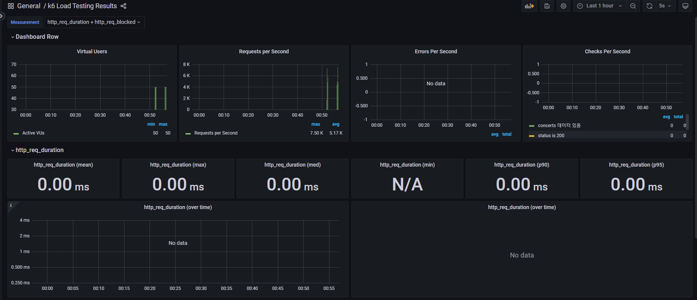

# Grafana

---

## 시행착오

### k6 부하 테스트 스크립트(js) 파일 위치

```
hh-08-concert/
├── src/
│   └── main/
│       └── java/
│           └── io/
│               └── hhplus/
│                   └── concert/
│                       └── ... (도메인 파일들)
├── docker-compose.yml
├── k6-scripts/
│   └── test.js

```

이 폴더는 **프로젝트의 자바 소스 폴더(`src/main/java/io/hhplus/concert/도메인 파일들`)와는 별개**로, 보통 프로젝트 루트(최상위)에 Docker 관련 파일들과 함께 두는 것이 일반적입니다.

- 이렇게 하면 docker-compose에서
    
    `volumes:
      - ./k6-scripts:/scripts`
    
    설정이 정상적으로 동작합니다.
    

### **테스트 데이터 세팅 전략**

콘서트 목록에 대한 부하 테스트를 진행할려고 합니다. 그런데 실제 DB에 더미 데이터가 없어서,
k6 스크립트의 setup() 함수에서 API를 통해 테스트용 콘서트 데이터를 생성하도록 했습니다.

DB에 직접 SQL로 넣는 방법도 있지만, API를 통한 데이터 세팅이 실제 서비스 흐름과 가장 유사하고 테스트 환경의 일관성도 높일 수 있습니다.

### **Docker Compose 기동 및 k6 컨테이너 실행 이슈**

처음에 “docker-compose up -d” 명령어를 통해 docker-compose에 있는 모든 서비스를 올렸더니, 

아래와 같이 에러가 발생하였습니다.

```
[+] Running 15/15
✔ Network hh-08-concert_default Created 0.1s
✔ Volume "hh-08-concert_mongodb_config" Created 0.0s
✔ Volume "hh-08-concert_influxdb_data" Created 0.0s
✔ Volume "hh-08-concert_grafana_data" Created 0.0s
✔ Volume "hh-08-concert_mysql-5-7-data" Created 0.0s
✔ Volume "hh-08-concert_redis_data" Created 0.0s
✔ Volume "hh-08-concert_redis_config" Created 0.0s
✔ Volume "hh-08-concert_kafka-data" Created 0.0s
✔ Volume "hh-08-concert_mongodb_data" Created 0.0s
✔ Container hh-08-concert-kafka-1 Created 5.3s
✔ Container mongodb Created 5.3s
✔ Container grafana Created 5.3s
✔ Container hh-08-concert-mysql-1 Created 5.3s
✔ Container redis Created 5.3s
✔ Container influxdb Created 5.3s
- Container k6 Creating 0.0s
Error response from daemon: no command specified
```

no command specified 에러는 k6 컨테이너에 실행 명령(command)이 없어서 발생합니다.
k6는 항상 docker-compose run k6 run ... 명령으로 실행하는 것이 맞으며,
인프라 서비스만 docker-compose up -d로 띄우고 그 다음 k6 명령어를 실행하면 됩니다.

그렇게 k6를 제외한 모든 외부 시스템을 도커로 실행시켰고, k6 명령어를 통해 스크립트 파일을 실행  시키는데 아래와 같이 에러가 발생하였습니다.

### **k6 스크립트 경로 및 볼륨 마운트 문제**

```
ERRO[0000] The moduleSpecifier "C:/Program Files/Git/scripts/get-concerts-load-test.js"
couldn't be found on local disk. Make sure that you've specified the right path to the
file. If you're running k6 using the Docker image make sure you have mounted the local
directory (-v /local/path/:/inside/docker/path) containing your script and modules so
that they're accessible by k6 from inside of the container...
```

이 에러는 k6 컨테이너에서 /scripts/get-concerts-load-test.js 파일을 찾지 못해서 발생합니다.
 Git Bash에서 상대경로 볼륨 마운트가 Windows Docker Desktop과 충돌하면서,
컨테이너 내부의 /scripts가 실제로 Windows의 C:/Program Files/Git/scripts로 잘못 매핑되었기 때문입니다.

```bash
docker run --rm -v C:\hanghae99\hh-08-concert\k6-scripts:/scripts grafana/k6 run /scripts/get-concerts-load-test.js

```

그래서 아래와 같은 명령어를 PowerShell에서 실행 시켜 k6 명령어를 실행하였습니다.

### **MySQL 연결/권한 문제**

하지만 아래와 같이 또 에러가 발생하였다.

```powershell
Access denied for user 'application'@'%' to database 'hhplus'
```

**MySQL 데이터베이스 'hhplus'에 대해 'application' 사용자가 접근 권한이 없어서** Spring Boot 애플리케이션이 DB 연결에 실패하고 있습니다.

확인해 보니, My sql에 hhplus라는 DB가 없기 때문에 에러가 발생한 것이었습니다.

그래서 MySQL 컨테이너에 접속해 아래 명령어를 실행하여 DB와 권한을 추가했습니다.

```bash
docker exec -it hh-08-concert-mysql-1 mysql -uroot -p ## 관리자로 접속

CREATE DATABASE hhplus;
GRANT ALL PRIVILEGES ON hhplus.* TO 'application'@'%';
FLUSH PRIVILEGES;
```

MySQL에 hhplus 데이터베이스가 반드시 있어야 하는 이유는,
Spring Boot 애플리케이션의 DB 연결 설정에서 해당 데이터베이스 이름을 사용하고 있기 때문입니다.

```bash
- MYSQL_DATABASE=hhplus # display에서 hhplus로 수정
```

- 여기서 **`hhplus`**가 바로 MySQL에 실제로 존재해야 할 데이터베이스 이름입니다.
- **애플리케이션이 실행될 때, 이 DB에 접속해서 테이블을 생성하거나 데이터를 읽고 쓰기 때문**입니다.
- 만약 해당 DB가 존재하지 않으면, "Unknown database 'hhplus'" 또는 "Access denied"와 같은 에러가 발생합니다.

### **Redis 연결 문제**

```bash
Host name must not be null or empty
```

- Spring Boot에서 Redis 연결을 위한 **`LettuceConnectionFactory`**를 생성할 때, **호스트 이름이 null 또는 빈 값**으로 전달되어 **`IllegalArgumentException: Host name must not be null or empty`** 예외가 발생합니다.
    - 이는 보통 application.yml 또는 application.properties에서 spring.redis.host(또는 spring.data.redis.host) 값이 누락되었거나, 환경 변수 주입이 제대로 되지 않아 발생합니다.

🧑‍💻 RedisProperties.java

```bash
@ConfigurationProperties(prefix = "spring.data.redis")
@Component
@Getter
@Setter
public class RedisProperties {
    private String host;
    private int port;
}
```

application.yml

```bash
  data:
    redis:
      host: localhost
      port: 6379
```

해당 파일에서 prefix 값이 “ spring.redis” 로 설정되어 있어, 아래와 같이 application.yml 설정과 달라host/port가 주입되지 않는 문제가 발생한 것이었습니다. 그래서 prefix와 yml 키를 일치시켜 정상적으로 연결됐습니다.

### **Grafana에서 그래프 표시**

InfluxDB 데이터 소스 연결은 정상적으로 이루어졌으나, 초기에는 Grafana 대시보드에 그래프가 표시되지 않는 문제가 있었습니다.

이 문제를 해결하기 위해서는 다음 세 가지 단계를 정확히 수행해야 합니다:

1. **Grafana에서 InfluxDB 데이터 소스를 추가**
    - URL: **`http://influxdb:8086`**
    - Database: **`k6`**
2. **k6 공식 Grafana 대시보드를 임포트**
    - Dashboard ID: 2587 또는 7587
    - 데이터 소스로 방금 추가한 InfluxDB(**`k6`**) 선택
3. **대시보드의 시간 범위(Time Range)를 적절히 조정**
    - 최근 데이터가 포함된 구간(예: "Last 5 minutes")으로 설정

이 세 가지 설정이 올바르게 적용되면,

**`docker-compose run --rm k6 k6 run /scripts/get-concerts-load-test.js`** 명령어로 k6 부하 테스트를 실행할 때 Grafana 대시보드에서 실시간으로 부하 테스트 결과가 시각화됩니다.

- 그래프는 테스트가 진행되는 동안 부하 상황을 실시간으로 보여주며,
    
    테스트 종료 후에도 마지막 결과를 확인할 수 있습니다.
    




## 1. 각 지표의 의미 (k6 기본 메트릭)

k6와 Grafana 대시보드에서 주로 보는 지표들은 다음과 같습니다.

| **지표명** | **의미** |
| --- | --- |
| **Virtual Users** | 동시에 부하를 주는 가상 사용자(VU, Virtual Users) 수. 부하 테스트의 동시성 수준을 의미. |
| **Requests per Second** | 초당 처리된 HTTP 요청 수. 시스템의 처리량(Throughput)을 나타냄. |
| **Errors Per Second** | 초당 발생한 에러(실패한 요청) 수. |
| **Checks Per Second** | 초당 체크(테스트 조건 검증) 수행 횟수. 예: 응답 코드가 200인지 등. |
| **http_req_duration** | HTTP 요청의 총 소요 시간(ms). 평균(mean), 최대(max), 중앙값(med), 최소(min), 90/95퍼센타일(p90/p95) 등으로 나뉨. |
| **http_req_blocked** | 요청이 대기(블록)된 시간. 네트워크 지연, 연결 풀 부족 등으로 인해 대기한 시간. |
- **http_req_duration**: 실제로 API 응답 속도(지연 시간)를 측정하는 핵심 지표입니다.
- **http_req_blocked**: 네트워크 연결 대기, 리소스 부족 등으로 인해 요청이 블록된 시간입니다[5](https://github.com/k6io/k6/issues/1321).
- **Checks**: k6 스크립트에서 **`check()`** 함수로 검증한 조건의 통과/실패 횟수입니다.